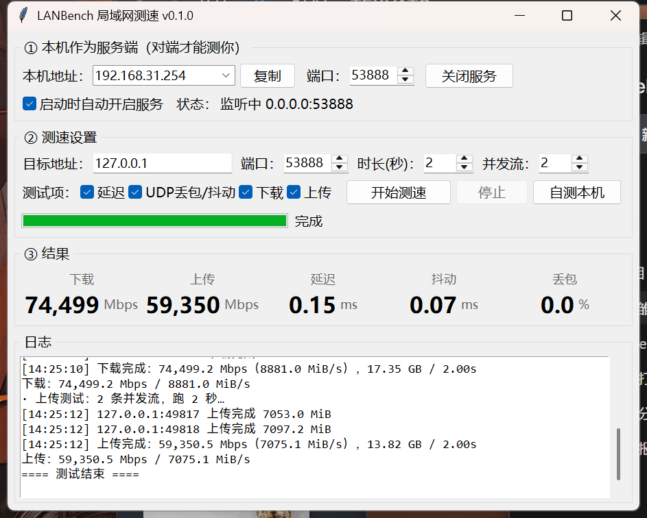

# LANBench 局域网测速 v0.1.0

一套**零第三方依赖**（只用 Python 标准库 + tkinter）的局域网测速工具：界面和服务端在同一个程序里，
两台机器各跑一份，就能互相测出**下载/上传吞吐、延迟、抖动、丢包**。



> 零依赖、单文件、带界面：适合"临时要测一下两台机器之间到底能跑多快"的场景。
> 需要专业级压测（TCP/UDP 各种参数、跨平台权威基准）请用 iperf3，本工具的定位见 [和 iperf3 有什么不同](#和-iperf3-有什么不同)。

## 下载 / 安装

三种方式，任选其一：

| 方式 | 做法 | 适合 |
| --- | --- | --- |
| 单文件（最省事） | 到 [Releases](https://github.com/Teyvat0/lanbench/releases) 下载 `LANBench.pyz` | 只想拿个文件就跑，目标机已装 Python |
| clone 源码 | `git clone https://github.com/Teyvat0/lanbench.git` | 想看代码 / 改代码 |
| 打包 exe | 双击 `打包.exe.bat` | 目标机**不想装 Python**（需联网装 PyInstaller） |

单文件版的用法：

```bash
python LANBench.pyz            # 打开界面
python LANBench.pyz serve      # 只跑服务端
python LANBench.pyz test 192.168.1.20
```

## 平台支持

| 平台 | 状态 |
| --- | --- |
| Windows 10 / 11 | 主力平台，一键 `.bat`、界面、防火墙提示都验证过（Python 3.12） |
| Linux / macOS | 代码是标准库 + tkinter，可跨平台运行；`.bat` 脚本不适用，直接用 `python lanbench.py`（部分发行版需另装 `python3-tk`） |

## 特点

- **下载 / 上传吞吐**：支持多并发流，按「跑满 N 秒」测量，比固定字节数更贴近真实带宽
- **延迟 / 抖动**：同一条连接打 10 次 TCP 往返，不重复握手，微秒级分辨率
- **丢包 / 抖动（UDP）**：100 个带序号+时间戳的探测包，能看出无线链路和拥塞的真实情况
- **一个程序两个角色**：勾选「启动时自动开启服务」，对端直接连过来测你，不用另开服务端
- **零依赖**：不需要 pip 装任何东西，Python 3.8+ 装了就能跑（开发环境为 3.12）；拷到 U 盘就能带到别的机器
- **命令行可用**：`test` 子命令支持 `--json`，方便写巡检脚本、批量采集

## 快速开始

### 方式 A：两台机器互相测（最常用）

1. 两台机器都装 Python 3.8+（Windows 安装包记得勾选 `tcl/tk`；本项目在 Python 3.12 上开发验证）
2. 把本文件夹整个拷过去，双击 **启动界面.bat**（或在目录里执行 `python lanbench.py`）
3. 界面①里显示的就是本机地址和端口，例如 `192.168.1.20:9527`
4. 在另一台机器的「目标地址」里填上这个地址和端口，点 **开始测速**
   - 想测反方向，就反过来填一次
5. 首次运行 Windows 会弹防火墙提示，**勾选「专用网络」并允许**，否则对端连不进来

> 只想验证本机是否正常：点 **自测本机**（走 127.0.0.1，回环能达到几十 Gbps）。

### 方式 B：一台常驻服务端，另一台命令行测

```bash
# 被测机器（无界面，适合放 NAS / 服务器 / 开机自启）
python lanbench.py serve --port 9527

# 测速机器
python lanbench.py test 192.168.1.20 --port 9527 --duration 10 --streams 4
```

输出示例：

```
TCP 延迟：发 10 收 10 丢包 0.0% | 最小 0.09 平均 0.13 最大 0.17 ms | 抖动 0.02 ms
UDP 探测：发 100 收 100 丢包 0.0% | 最小 0.04 平均 0.12 最大 0.21 ms | 抖动 0.08 ms
下载：75,287.8 Mbps（8975.0 MiB/s，17.53 GB）
上传：66,651.7 Mbps（7945.5 MiB/s，15.52 GB）
对端主机名：LIYUE-HARBOR
```

## 界面说明

| 区域 | 说明 |
| --- | --- |
| ① 本机作为服务端 | 「本机地址」可下拉切换网卡（机器有多个网段时选对的那个）；端口默认为 9527；点【复制】把 `IP:端口` 复制给对端 |
| ② 测速设置 | 目标地址/端口、每方向时长（默认 10 秒）、并发流（默认 4）、勾选要跑的测试项 |
| ③ 结果 | 下载 / 上传（Mbps）、延迟（ms）、抖动（ms）、丢包（%） |
| 日志 | 每一步的时间戳记录，排查问题时看这里 |

## 命令行用法

```bash
python lanbench.py                       # 打开界面（等价于 gui）
python lanbench.py gui --port 9527       # 指定本机服务端口
python lanbench.py gui --no-serve        # 只当客户端，不开本机服务
python lanbench.py serve --port 9527     # 纯服务端
python lanbench.py test 192.168.1.20     # 命令行测速
python lanbench.py firewall --port 9527  # 打印放行防火墙的命令
```

`test` 的常用参数：

| 参数 | 说明 |
| --- | --- |
| `--duration 10` | 每个方向跑多少秒（默认 10） |
| `--streams 4` | 并发连接数（默认 4，跑不满千兆时可以加大） |
| `--no-download` / `--no-upload` | 跳过某个方向 |
| `--no-ping` / `--no-udp` | 跳过延迟 / UDP 探测 |
| `--json` | 只输出 JSON，方便脚本解析 |

## 端口与防火墙

只需要放行**一个端口**（默认 9527）的 **TCP + UDP 入站**。以管理员身份运行：

```bat
netsh advfirewall firewall add rule name="LANBench 9527" dir=in action=allow protocol=TCP localport=9527
netsh advfirewall firewall add rule name="LANBench 9527 UDP" dir=in action=allow protocol=UDP localport=9527
```

也可以 `python lanbench.py firewall` 直接打印这两条命令。

## 结果怎么看

| 网络 | 正常参考值 |
| --- | --- |
| 千兆有线（1GbE） | 900 ~ 950 Mbps |
| 2.5G 有线 | 2.2 ~ 2.4 Gbps |
| WiFi 5 / WiFi 6（近距离） | 300 ~ 900 Mbps，抖动比有线大一个量级 |
| 本机回环 | 几十 Gbps（只代表程序本身不是瓶颈） |

几个经验：

- **跑不满就加并发流**：单条连接会受 CPU、窗口大小限制；`--streams 8` 常常能把千兆打满
- **只有单向慢**：常见于网卡节能/半双工协商问题，先用 `--no-download` / `--no-upload` 分离确认
- **延迟低但吞吐低**：多半是网线/交换机协商速率不对（百兆线接千兆口）
- **UDP 丢包高但 TCP 好**：链路有突发拥塞或无线干扰，TCP 的重传把丢包掩盖了

### 统计口径（想较真时看）

- 吞吐窗口从**并发流全部握手完成**那一刻开始计时，不含建连开销；
- 下载方向统计**客户端实际收到的字节数**；
- 上传方向以**服务端确认收到的字节数**（协议里的 ack）为准，而不是"本地塞进发送缓冲"的数量——
  否则链路异常时上传速率会虚高；
- UDP 丢包率的分母是**发送尝试次数**，发不出去的包也算丢，不会假报 0%。

## 目录结构

```
lan-speedtest/
├─ lanbench/
│  ├─ protocol.py    线协议：握手、命令、报文编解码
│  ├─ server.py      服务端：TCP 多命令连接 + UDP 回显
│  ├─ client.py      测速引擎：延迟/抖动/丢包/多流吞吐
│  ├─ gui.py         tkinter 界面
│  ├─ cli.py         命令行入口
│  └─ netutil.py     本机地址探测
├─ lanbench.py       启动器（等价 python -m lanbench）
├─ selftest.py       回环自检，15 项断言（含端口占用、停机重绑等回归用例）
├─ guitest.py        界面冒烟测试（真实开窗跑一轮 + 截图 + 布局越界检查）
├─ README.md / LICENSE / .gitignore / .gitattributes
├─ 启动界面.bat       双击开界面
├─ 服务端.bat         双击当纯服务端
├─ 自检.bat           双击跑自检
├─ 打包.pyz.bat       打成单文件 LANBench.pyz（目标机仍需装 Python）
└─ 打包.exe.bat       打成免装 Python 的 exe（需要联网装 pyinstaller）
```

## 自检 / 打包

```bash
python selftest.py            # 回环跑一轮，15 项断言全部应为 PASS
python guitest.py             # 开真窗口跑一轮、截图、并检查控件有没有被裁掉

打包.pyz.bat                  # 生成 LANBench.pyz（单文件，需 Python）
打包.exe.bat                  # 生成 dist\LANBench-GUI.exe / LANBench-Serve.exe（免 Python）
```

## 常见问题

**对端连不上 / 超时？**
1. 确认对端界面上显示「监听中 0.0.0.0:端口」；
2. 确认放行了防火墙端口（见上）；
3. 确认两台机器在同一网段、能互相 ping 通；
4. 对端如果是虚拟机，注意网卡模式（NAT 模式下宿主机连不进去，要桥接）。

**提示「对端不是 LANBench 服务」？**
说明该端口被别的程序占用了，换个端口即可。

**机器有多张网卡（虚拟网卡、Docker、WSL、VPN）？**
界面①的下拉框里逐个试，选真实网卡那个地址（通常是有默认网关的那个）。

**测出来的数字比 iperf3 低？**
本工具是纯 Python 实现，单流上限受 CPU 影响，用多并发流（`--streams 8`）通常能追平。
本机回环能跑到 100+ Gbps，说明瓶颈在网络而不是程序。

## 和 iperf3 有什么不同

iperf3 是权威、跨平台、参数极全的基准工具；本工具不是要替代它，而是补它不好用的那一段：

| | LANBench | iperf3 |
| --- | --- | --- |
| 上手成本 | 双击打开界面，两边都跑同一个程序，填 IP 就能测 | 一台 `-s` 一台 `-c`，参数要看文档 |
| 图形界面 | 有 | 无（只有命令行输出） |
| 服务端与客户端 | 同一个程序，自动开服务 | 两个角色、两条命令 |
| 默认测试内容 | 延迟 + 抖动 + UDP 丢包 + 双向吞吐，一次点完 | 需要分别跑 |
| 协议 | 自定义私有协议 | iperf3 协议（生态更广） |
| 依赖 | Python 标准库 | C 程序，需自行编译/下载 |
| 精度/可调参数 | 够用但不极致 | 专业级 |

一句话：**要严格基准数据用 iperf3，要"拿起来就能测、还能给同事看界面"用这个。**

## 已知限制

- 只测网络层吞吐，不测磁盘/应用层（不做文件读写测试）
- 没有加密和认证，**仅限内网使用**，不要把这个端口暴露到公网
- 服务端目前不做连接数限制，同网段内谁都能连（内网工具，够用为先）
- 单流吞吐受 Python 的 CPU 开销影响，测千兆以上建议用默认的多并发流

## 线协议（想自己对接时看）

```
握手：  C->S  "LBS1"            S->C  "LBS1" + ver(1B) + nameLen(1B) + 主机名
命令：  PING      "P" + token(8B LE)      -> 原样回显 9 字节
        DOWNLOAD  "D" + size(4B BE)       -> 发 size 字节；size=0 表示一直发到客户端断开
        UPLOAD    "U" + size(4B BE)       -> 收 size 字节；size=0 表示收到 EOF；收完回 8 字节 ack
UDP  ：  同一端口，收到什么原样回显
```

一条 TCP 连接可以连续执行多条命令（延迟测试就是这么省握手的）。

## 开源协议

[MIT](LICENSE) —— 随便用、随便改、可商用，保留版权声明即可。

欢迎提 Issue / PR。改完代码请先跑一遍 `python selftest.py`（15 项）和 `python guitest.py`，两个都过了再发 PR。
